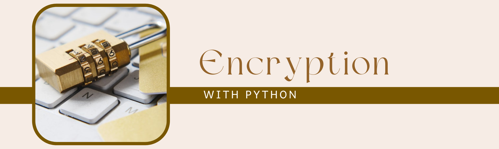

# cryptography



<script src="https://polyfill.io/v3/polyfill.min.js?features=es6"></script>
<script id="MathJax-script" async src="https://cdn.jsdelivr.net/npm/mathjax@3/es5/tex-mml-chtml.js"></script>
# Symmetric verus Asymmetric Ciphers

#### **Purpose**:
Cryptography is a tool used more often than realized.  For example, SSH keys used on a computer are asymmetric ciphers and use algorthims like RSA.  The conceptual process is often described but how the math works for even simple, outdated processes is rarely provided.    This repo explores the mathematical processes involved in a simple Diffie-Hellman Key.

#### **Background**:
Originally, I tried to develop this module to help students of a Data Science Bootcamp understand their public and private SSH keys and how they are used on github/gitlab.  Due to the students experience early in the term is only Excel, I tried to write everything in VBA but quickly realized that the numbers generated through this process become too large for excel and keys could only be slightly larger than single digits before throwing an overflow error.  The script was converted over to Python and it worked much better.

## **Symmetric Encryption**
**Note**:  I have seen this example provided as asymmetric encryption but it seems to be more like symmetric encryption because a 'secret key' or a second 'encryption method' unknown to anyone else needs shared for the proess to be secure and prevent a third-party from being able to decipher the communications.  I will have a better example later in the document that uses `RSA` method to create `oneway functions`.  

#### **The Math Without One Way Functions**:
This example works with one key issue -- a public key and a partial key must be transferred between the sender and receiver.  The partial key provides the extra information needed to decode the message but anyone could do this by plugging the partial key and public key into the correct equation.  In many cases this is described as asymmetric authentication but it really is not.  I have modified reference [1] to be a bit more believable.  Later, I will show a true asymmetric authication that uses the RSA algorithm.  

The key algorthims are Equations [1] and [2].  These equations can be created by combining Equations [5] and [6] and Equations [4] and [7], repectively.  
$$
\tag{1} K_{full,a} = (K_{g}^{K_{b}} \bmod K_{p})^{K_{a}} \bmod K_{p}
$$  
$$
\tag{2} K_{full,b} = (K_{g}^{K_{a}} \bmod K_{p})^{K_{b}} \bmod K_{p}
$$  
The mathematical relationship that shows equivalency is Equation [3].  This relationship shows that $K_{full,a} = K_{full,b}$. `Note: The K's were removed to make the equation more readable.`
$$ 
\tag{3}(g^a \bmod p)^b \bmod \ \ p = (g^b \bmod p)^a \bmod p = g^{ab} \bmod p 
$$

<br>

It is easier to see how this works by breaking it into parts.  Equations [4] and [5] can be completed by the the sender and receiver independently.  

$$
\tag{4} K_{part,a} = (K_{g})^{K_{a}} \bmod K_{p}
$$

$$
\tag{5} K_{part,b} = (K_{g})^{K_{b}} \bmod K_{p}
$$
<br>

The Key Parts can be sent to the other user and using the other users Key Part and Public Key a secret number can be determined that is the same for both users, aka $K_{full,a} = K_{full,b}$.
$$
\tag{6} K_{full,a} = (K_{part,b})^{K_{a}} \bmod K_{p}
$$

$$
\tag{7} K_{full,b} = (K_{part,a})^{K_{b}} \bmod K_{p}
$$  
<br>

$$
\begin{align*}
where \ \ \ \ a& = \text{Private Key Sender} \\
b& = \text{Private Key Receiver} \\
g& = \text{Public Key Sender} \\
p& = \text{Public Key Receiver } \\
K& = \text{Key}
\end{align*}
$$

From Reference [1], it was recommending that the public key ( i.e. $K_{a}$) and partial key ( i.e. $K_{part,a}$) would both be transmitted but if this is true then anyone that intercepts the transmission of both parties could fill in the values in Equation [6] or [7].  

A possible solution to this problem would be to hae a secure method of transferring and storing the 'public key' ( i.e. $K_{a}$) and only tranmitting the 'partial key' ( i.e. $K_{part,a}$).  This would only expose the Key Part but then this would be an example of `symmetric authenitication`.


## Authentication Process
1.  Two users must decide that they would like to transfer information but in a secure way.  I will call them the requester and the sender.
    *  In the real world we need to be specific about the roles.  Many times this is overlooked when discussing asymmetric authentication.  
    *  In this example, we will say that the sender is the user that needs to verify that the other person is real before providing them information.   
    ```Note:  This is important detail because it affects the process.  Later, the sender will send an encrypted message to the receiver and ask them to decode it and send it back.  If the message matches the original message then their authencity has been confirmed.```
1.  First, the users choose numbers for a private key and a public key.  The private key should not be shared with anyone.  For the program written, I would choose numbers between 100 and 9,999.  Much larger numbers could be selected but this keeps the calculation steps very brief.
1.  Next, the two users must exchange public keys.  This is not sensitive information.  The expectation is that a 3rd party that is up to no good can have them and it doesn't cause an issue.
1.  Next, the sender gives a calculated "partial" key to the receiver using `Equation 1`.  
1.  The receiver decrypts the message using `Equation 3` and then encrypts it with `Equation 5` and sends this value to the sender.
1.  The sender now uses `Equation 4` to translate the 

Why do this - Time complexity of Finding Prime Roots
<br>
<br>

## **Asymmetric Encryption:  Authentication with Trapdoor One Way Functions**
***
### Types of public/private key generation algorithms 

*  **Rivest-Shamir-Adelman (RSA)** – Oldest of the public-private key cryptography systems. Frequently used to transmit shared keys for symmetric key cryptography  

*  **Digital Signature Standard (DSS)** – a Federal Information Processing Standard specifying the algorithms that can be used to generate digital signatures used by NIST  

*  **Elliptic curve cryptography (ECC)** – As its name implies, ECC relies on elliptic curves to generate keys. Often used for key agreement and digital signatures. At PreVeil, we use elliptic-curve cryptography’s Curve-25519 and NIST P-256.  

    *Source* :  <cite>https://www.preveil.com/blog/public-and-private-key/#:~:text=Public%20and%20private%20keys%20form,to%20encrypt%20and%20decrypt%20messages.</cite>  
<br>

## Authentication Process  

### Generating Public and Private Keys   
The sender and receiver will need to this part.  

***

1.  Generate two prime number: $ \ p_{1}$, $p_{2}$   
    *  i.e. 7, 11
2.  Calculate their product:  $ \ n = p_{1} * p_{2}$  
    *  i.e. n = 77
4.  Calculate Prime Factorization:  $\phi(n) = (p_{1}-1)*(p_{2} - 1)$ 
    * i.e. $\phi(n)$ = 3016
3.  Select a random value between 1 and $\phi(n)$
    *  i.e. e = 3
$$
\text{where e} = \begin{cases}
\ *&\text{small number}  \\
\ *&\text{odd number} \\
\ *&\text{not a root of } \phi(n) \\
\end{cases}
$$    

5.  Calculate the private key, $d$ :   
$$
\tag{Private Key} d = {k \phi(n) + 1 \over e}
$$
6.  { $n,e$ } make up the public key.
<br>  
<br>

## Sending/Receiving Encrypted Messages
***
7.  The sender gives the receiver the{ $n,e$ } and the receiver uses this information to encrypt their message using the senders public key { $n,e$ }:  

$$
\tag{encrypted message} c_{m} = m^e \bmod n  
$$  

9.  The receiver sends the encrypted message back to the sender and the message is unscrambled with the private key by solvind for $m_{0}$:
$$
\tag{decrypted message} m = {c_{m}}^{ed} \bmod n
$$
## Example
***
1. Sender Calculates { e, n }
$$
p_{1} = 53 \\
p_{2} = 59 \\
n = 3127 \\
e = 3 \\
$$
2.  Sender Calculates Private Key, d
$$
d = {2*3016+1\over 3} = 2011
$$
3.  Receiver Encrypts Message, m, with { e,n }
$$
m_{r} = 1394 \\
c_{m_{r}} = (1394)^3 \bmod 3127 = 916
$$
4.  Sender Decrypts Message using Private Key, d
$$
m_{r} = {(916)^{3*2011} \bmod \ 3127} = 1394
$$
5.  This shows that the outside world only sees e, n, c.  The value of n and $\phi(n)$ is still unknown and would take incredible computing power to determine `(assuming larger prime numbers were selected than in this example)` 


## Theory    
***
5.  Prime Factorization is not easy to calculate.  The larger the number results in an exponential longer amount of time for the factorization to complete.  It can take days or even years for a computer to calculate factorizations for large numbers.  The concept of the difficulty to calculate resulting in long delays is called Time Complexity. 
5.  One Way Function Derivation:  
$$
\tag{1} m^{\phi(n)} = 1 \bmod n  
$$
$$
\tag{2} m^{k\phi(n)} = 1 \bmod n
$$
$$
\tag{3} m*m^{k\phi(n)} = m \bmod n
$$
$$
\text{simplify to} \\
m^{k \phi(n) + 1} = m \bmod n
$$
$$
\text{by equivalency} \\
m^{ed} = m \bmod n
$$
$$
\tag{4} ed = k \phi(n) + 1
$$
where d is the private key
and e is a random selected small number


<br>
<br>

[Note][1] There is an error in the equation used in the Khan Academy video.  The equations in this document are correct. 

[Note][2] 

Resource:  
[1]: https://www.khanacademy.org/computing/computer-science/cryptography/modern-crypt/v/intro-to-rsa-encryption  "Khan Academy RSA Encryption"  
[2]: https://www.geeksforgeeks.org/how-to-solve-rsa-algorithm-problems/ "Geeks For Geeks RSA Encryption"  


